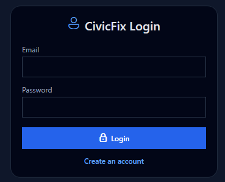
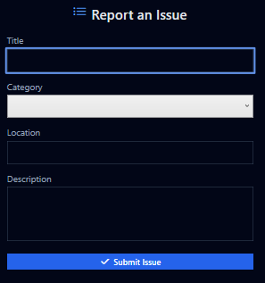

# CivicFix

CivicFix is a WPF desktop application for reporting and managing civic issues with a role-based architecture. The application includes dashboards for citizens, agents, and administrators, and focuses on clean UI, dark mode design, and structured workflows.

## 🧠 Features
- Citizen issue reporting with title, description, location
- Role-based dashboards (Admin / Agent / Citizen)
- Issue status tracking (Pending · In Progress · Resolved · Rejected)
- Agent availability and assignment
- Audit logging for administrative actions
- Modern dark mode UI with consistent styling

## 🛠️ Technologies Used
- C# and .NET
- WPF (Windows Presentation Foundation)
- XAML for UI
- MVVM design pattern
- Git & GitHub for version control

## 🚀 Getting Started

### 📥 Clone the repository

```bash
git clone https://github.com/Yesser-tn/CivicFix
```
### ▶ Run the application

1. Open `CivicFix.sln` in Visual Studio
2. Restore NuGet packages if prompted
3. Build the solution
4. Run the project

## 📸 Screenshots

### Login


### Admin Dashboard


### Categories Management


### Create Issue

